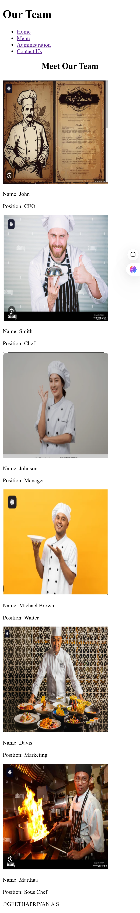
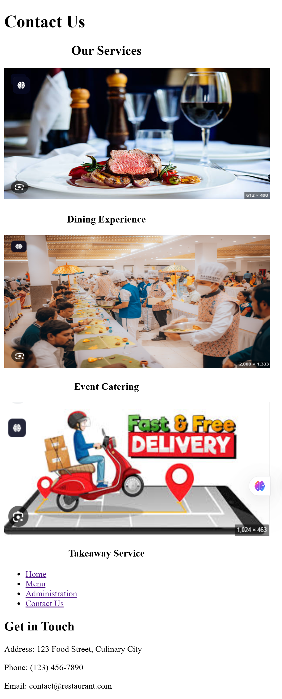

# Ex.07 Restaurant Website
## Date:23.12.2024

## AIM:
To develop a static Restaurant website to display the food items and services provided by them.

## DESIGN STEPS:

### Step 1:
Requirement collection.

### Step 2:
Creating the layout using HTML and CSS.

### Step 3:
Updating the sample content.

### Step 4:
Choose the appropriate style and color scheme.

### Step 5:
Validate the layout in various browsers.

### Step 6:
Validate the HTML code.

### Step 7:
Publish the website in the given URL.

## PROGRAM:
```
<!DOCTYPE html>
<html lang="en">
<head>
    <meta charset="UTF-8">
    <meta name="viewport" content="width=device-width, initial-scale=1.0">
    <title>Restaurant Website</title>
    <style>
        /* Global Styles */
        body {
            font-family: Arial, sans-serif;
            margin: 0;
            padding: 0;
            background-color: #f0f0f0;
        }
        header {
            background-color: #333;
            color: #fff;
            padding: 20px 0;
        }
        header .banner h1 {
            text-align: center;
            margin: 0;
            font-size: 2em;
        }
        nav ul {
            text-align: center;
            list-style: none;
            padding: 0;
        }
        nav ul li {
            display: inline;
            margin: 0 15px;
        }
        nav ul li a {
            color: #fff;
            text-decoration: none;
            font-size: 1.2em;
        }
        footer {
            background-color: #333;
            color: #fff;
            text-align: center;
            padding: 10px;
            position: fixed;
            width: 100%;
            bottom: 0;
        }
        /* Main content */
        main {
            margin: 20px;
        }
        section.welcome, section.menu, section.contact-info, section.team {
            margin: 20px 0;
            padding: 20px;
            background-color: #fff;
            border-radius: 8px;
            box-shadow: 0 0 10px rgba(0, 0, 0, 0.1);
        }
        h2 {
            color: #333;
        }
        ul {
            list-style: none;
            padding: 0;
        }
        ul li {
            font-size: 1.1em;
            margin: 5px 0;
        }
        .team-member {
            display: inline-block;
            width: 30%;
            margin: 10px;
            text-align: center;
        }
        .team-member img {
            width: 100%;
            height: auto;
            border-radius: 50%;
        }
        .team-member p {
            font-size: 1.1em;
        }
    </style>
</head>
<body>
    <header>
        <div class="banner">
            <h1>Welcome to Our Restaurant</h1>
        </div>
        <nav>
            <ul>
                <li><a href="index.html">Home</a></li>
                <li><a href="menu.html">Menu</a></li>
                <li><a href="administration.html">Administration</a></li>
                <li><a href="contactus.html">Contact Us</a></li>
            </ul>
        </nav>
    </header>
    <main>
        <section class="welcome">
            <div class="welcome">
                
               
            </div>

            <h2>Experience the Best Dishes!</h2>
            <p>We serve delicious food that makes you feel at home.</p>
        </section>
    </main>
    <footer>
        <p>&copy;GEETHAPRIYAN A S</p>
    </footer>
</body>
</html>

index.html


<!DOCTYPE html>
<html lang="en">
<head>
    <meta charset="UTF-8">
    <meta name="viewport" content="width=device-width, initial-scale=1.0">
    <title>Restaurant Website</title>
    <style>
        /* Global Styles */
        body {
            font-family: Arial, sans-serif;
            margin: 0;
            padding: 0;
            background-color: #f0f0f0;
        }
        header {
            background-color: #333;
            color: #fff;
            padding: 20px 0;
        }
        header .banner h1 {
            text-align: center;
            margin: 0;
            font-size: 2em;
        }
        nav ul {
            text-align: center;
            list-style: none;
            padding: 0;
        }
        nav ul li {
            display: inline;
            margin: 0 15px;
        }
        nav ul li a {
            color: #fff;
            text-decoration: none;
            font-size: 1.2em;
        }
        footer {
            background-color: #333;
            color: #fff;
            text-align: center;
            padding: 10px;
            position: fixed;
            width: 100%;
            bottom: 0;
        }
        /* Main content */
        main {
            margin: 20px;
        }
        section.welcome, section.menu, section.contact-info, section.team {
            margin: 20px 0;
            padding: 20px;
            background-color: #fff;
            border-radius: 8px;
            box-shadow: 0 0 10px rgba(0, 0, 0, 0.1);
        }
        h2 {
            color: #333;
        }
        ul {
            list-style: none;
            padding: 0;
        }
        ul li {
            font-size: 1.1em;
            margin: 5px 0;
        }
        .team-member {
            display: inline-block;
            width: 30%;
            margin: 10px;
            text-align: center;
        }
        .team-member img {
            width: 100%;
            height: auto;
            border-radius: 50%;
        }
        .team-member p {
            font-size: 1.1em;
        }
    </style>
</head>
<body>
    <header>
        <div class="banner">
            <h1>Welcome to Our Restaurant</h1>
        </div>
        <nav>
            <ul>
                <li><a href="index.html">Home</a></li>
                <li><a href="menu.html">Menu</a></li>
                <li><a href="administration.html">Administration</a></li>
                <li><a href="contactus.html">Contact Us</a></li>
            </ul>
        </nav>
    </header>
    <main>
        <section class="welcome">
            <div class="welcome">
                
               
            </div>

            <h2>Experience the Best Dishes!</h2>
            <p>We serve delicious food that makes you feel at home.</p>
        </section>
    </main>
    <footer>
        <p>&copy;GEETHAPRIYAN A S</p>
    </footer>
</body>
</html>

menu.html

<!DOCTYPE html>
<html lang="en">
<head>
    <meta charset="UTF-8">
    <meta name="viewport" content="width=device-width, initial-scale=1.0">
    <title>Restaurant Website</title>
    <style>
        /* Global Styles */
        body {
            font-family: Arial, sans-serif;
            margin: 0;
            padding: 0;
            background-color: #13231f;
        }
        header {
            background-color: #333;
            color: #fff;
            padding: 20px 0;
        }
        header .banner h1 {
            text-align: center;
            margin: 0;
            font-size: 2em;
        }
        nav ul {
            text-align: center;
            list-style: none;
            padding: 0;
        }
        nav ul li {
            display: inline;
            margin: 0 15px;
        }
        nav ul li a {
            color: #fff;
            text-decoration: none;
            font-size: 1.2em;
        }
        footer {
            background-color: #333;
            color: #fff;
            text-align: center;
            padding: 10px;
            position: fixed;
            width: 100%;
            bottom: 0;
        }
        /* Main content */
        main {
            margin: 20px;
        }
        section.welcome, section.menu, section.contact-info, section.team {
            margin: 20px 0;
            padding: 20px;
            background-color: #fff;
            border-radius: 8px;
            box-shadow: 0 0 10px rgba(0, 0, 0, 0.1);
        }
        h2 {
            color: #333;
        }
        ul {
            list-style: none;
            padding: 0;
        }
        ul li {
            font-size: 1.1em;
            margin: 5px 0;
        }
        .team-member {
            display: inline-block;
            width: 30%;
            margin: 10px;
            text-align: center;
        }
        .team-member img {
            width: 100%;
            height: auto;
            border-radius: 50%;
        }
        .team-member p {
            font-size: 1.1em;
        }
    </style>
</head>
<body>
    <header>
        <div class="banner">
            <h1>ROYAL BREEZE</h1>
        </div>
        <div class="banner">
            <center></center>
           
        </div>

        <nav>
            <ul>
                <li><a href="index.html">Home</a></li>
                <li><a href="menu.html">Menu</a></li>
                <li><a href="administration.html">Administration</a></li>
                <li><a href="contactus.html">Contact Us</a></li>
            </ul>
        </nav>
    </header>
    <main>
        <section class="welcome">
            <h2>Taste the quality food from good chefs and servants...</h2>
            <p>....</p>
            
        </section>
    </main>
    <footer>
        <p>&copy;GEETHAPRiYAN A S</p>
    </footer>
</body>
</html>

administration.html

<!DOCTYPE html>
<html lang="en">
<head>
    <meta charset="UTF-8">
    <meta name="viewport" content="width=device-width, initial-scale=1.0">
    <title>Administration</title>
    <link rel="stylesheet" href="styles.css">
</head>
<body>
    <header>
        <div class="banner">
            <h1>Our Team</h1>
        </div>
        <nav>
            <ul>
                <li><a href="index.html">Home</a></li>
                <li><a href="menu.html">Menu</a></li>
                <li><a href="administration.html">Administration</a></li>
                <li><a href="contactus.html">Contact Us</a></li>
            </ul>
        </nav>
    </header>
    <main>
        <section class="team">
            <center><h2>Meet Our Team</h2></center>
            <div class="team-member">
                
                <p>Name: John </p>
                <p>Position: CEO</p>
            </div>
            <div class="team-member">
                
                <p>Name:  Smith</p>
                <p>Position: Chef</p>
            </div>
            <div class="team-member">
                
                <p>Name: Johnson</p>
                <p>Position: Manager</p>
            </div>
            <div class="team-member">
                
                <p>Name: Michael Brown</p>
                <p>Position: Waiter</p>
            </div>
            <div class="team-member">
                
                <p>Name:  Davis</p>
                <p>Position: Marketing</p>
            </div>
            <div class="team-member">
                
                <p>Name: Marthaa</p>
                <p>Position: Sous Chef</p>
            </div>
        </section>
    </main>
    <footer>
        <p>&copy;GEETHAPRIYAN A S</p>
    </footer>
</body>
</html>


contactus.html

<!DOCTYPE html>
<html lang="en">
<head>
    <meta charset="UTF-8">
    <meta name="viewport" content="width=device-width, initial-scale=1.0">
    <title>Contact Us</title>
    <link rel="stylesheet" href="styles.css">
</head>
<body>
    <header>
        <div class="banner">
            <h1>Contact Us</h1>
        </div>
        <center><section id="services" class="services">
            <h2>Our Services</h2>
            <div class="service">
                
                <h3>Dining Experience</h3>
            </div>
            <div class="service">
                
                <h3>Event Catering</h3>
            </div>
            <div class="service">
                
                <h3>Takeaway Service</h3>
            </div>
        </section>
    </center>
        <nav>
            <ul>
                <li><a href="index.html">Home</a></li>
                <li><a href="menu.html">Menu</a></li>
                <li><a href="administration.html">Administration</a></li>
                <li><a href="contactus.html">Contact Us</a></li>
            </ul>
        </nav>
    </header>
    <main>
        <section class="contact-info">
            <h2>Get in Touch</h2>
            <p>Address: 123 Food Street, Culinary City</p>
            <p>Phone: (123) 456-7890</p>
            <p>Email: contact@restaurant.com</p>
        </section>
    </main>

</body>
</html>


```


## OUTPUT:








## RESULT:
The program for designing software company website using HTML and CSS is completed successfully.
